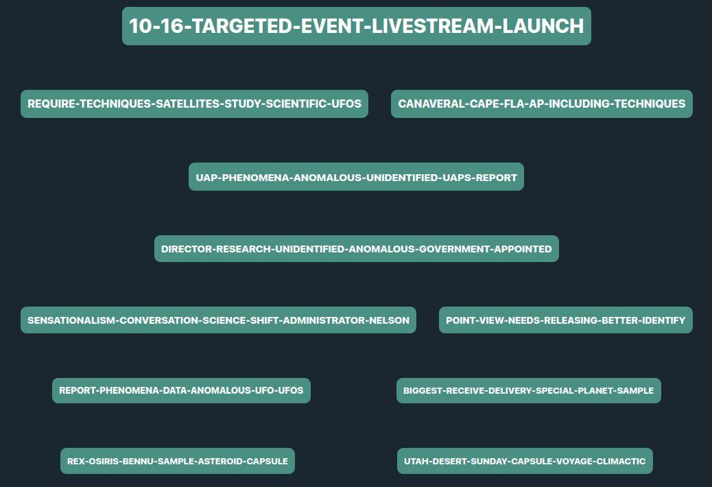

## Description:
**chronicle2050** is a web application *(developed in the course of my bachelor's thesis)* that allows users to input an **entity of interest** and **retrieve future-related sentences** extracted from **thousands of articles**. The extracted sentences are then **visualized on a timeline**, providing users with a comprehensive view of **future insights** related to the specified entity.

## Website:
Upon completion of the project, the app will be available at <a href="https://chronicle2050.regevson.com/"><b>chronicle2050</b></a>.

## Tech:
The application utilizes a combination of machine learning techniques, including fine-tuned DistilRoBERTa for classification and BERTopic for clustering.
The backend of the application is developed using Django, while the frontend is built using Vue.js. All deep learning components are run on GoogleColab.

## Usage:

1. Open the web application in your preferred browser.
2. Enter the name of the entity you want to explore future insights for in the input field.
3. Click the *explore* button to initiate the data retrieval process.
4. Wait for the application to download articles, extract sentences, classify them, and cluster them based on future insights.
5. Once the process is complete, the timeline visualization will be displayed, allowing you to explore the future insights related to the specified entity.

## News API:
For this project I am using <a href="https://newscatcherapi.com/"><b>Newscatcher API</b></a>.

## Screenshots:

